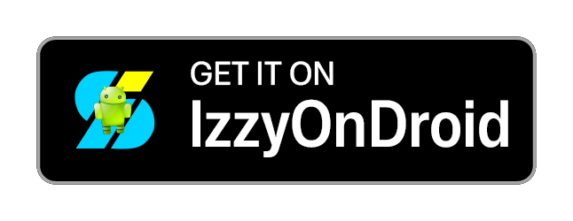
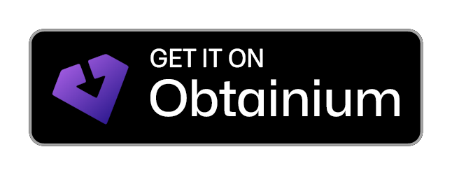
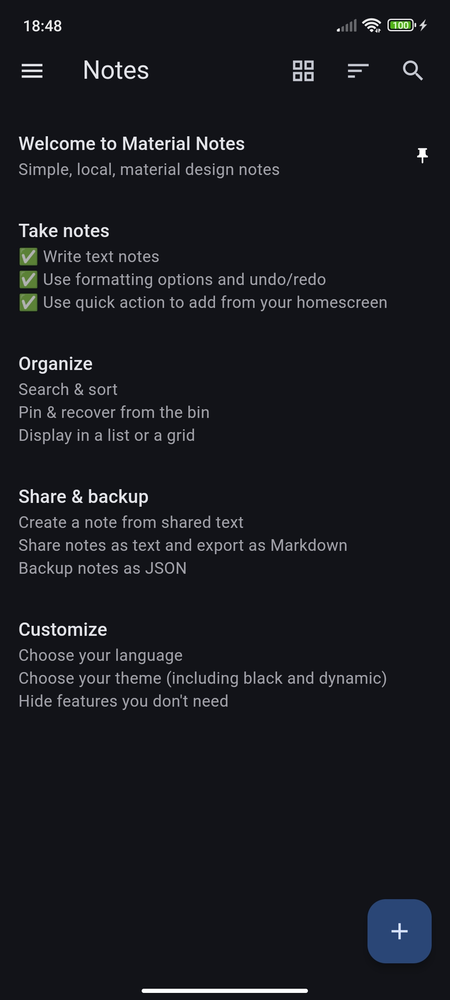
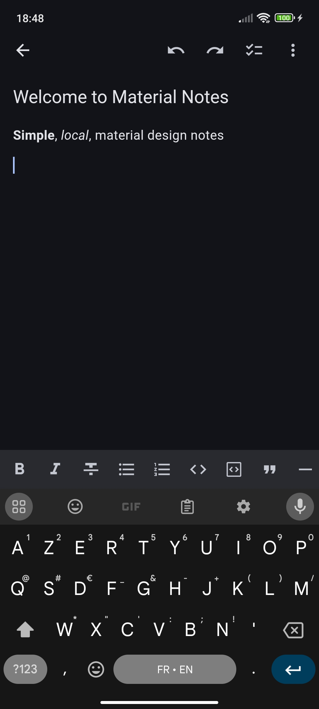
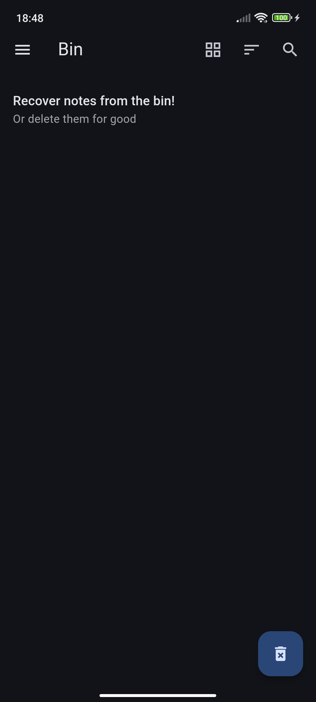
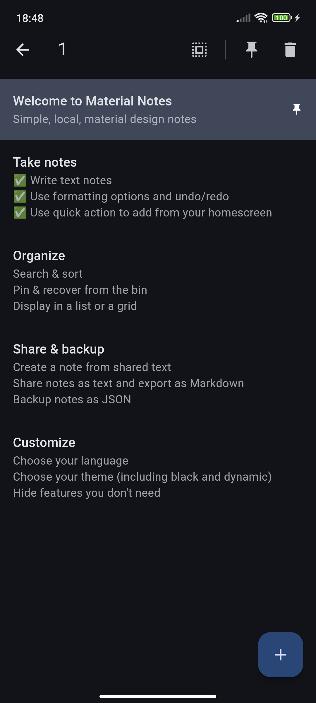
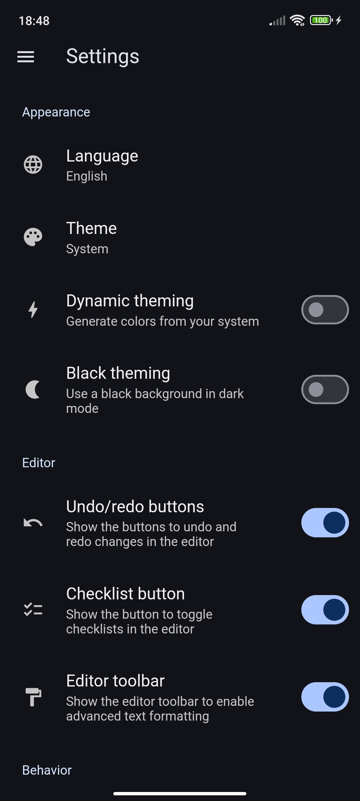
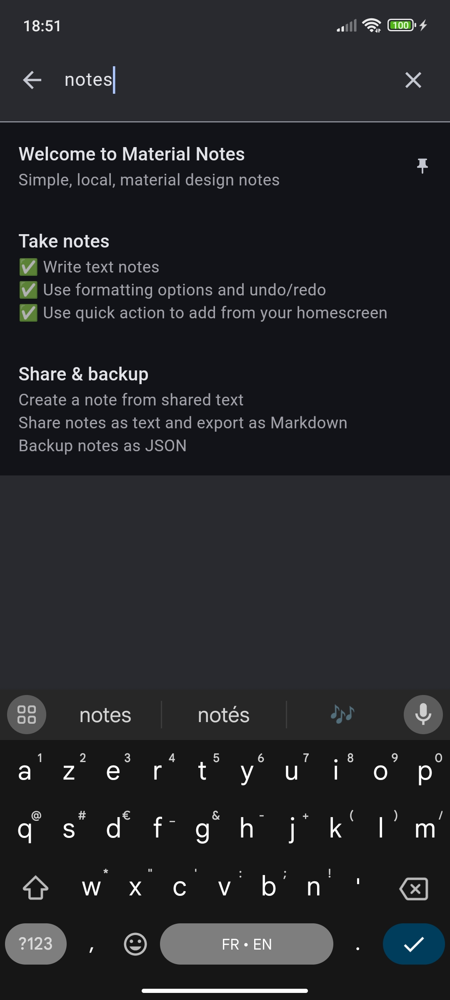
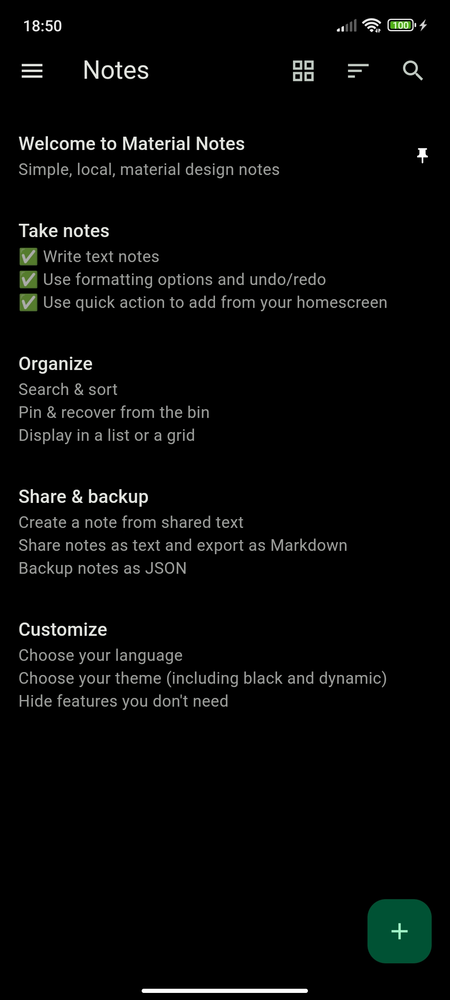
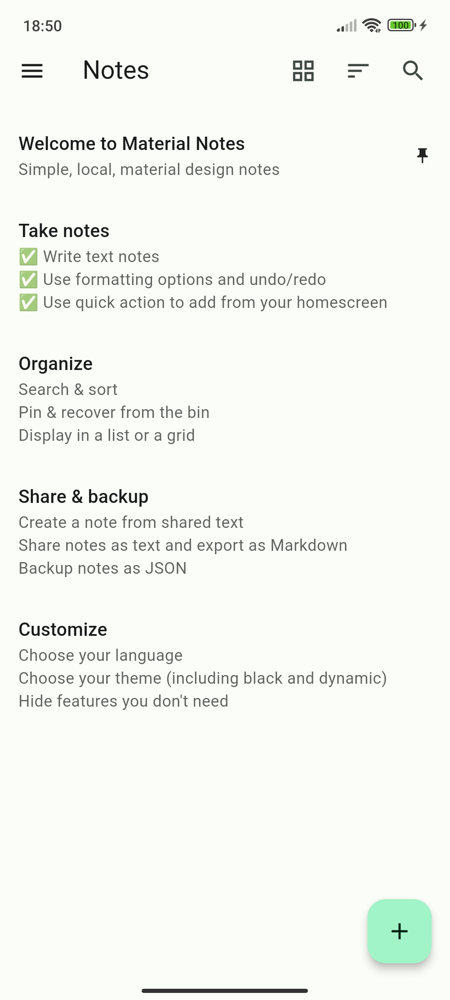

 

 

# Local Material Notes

Simple, local, material design notes.

  
  
  
  

  
  
  
  

## Features

### Take notes

- Write text notes (title and content)
- Take advantage of the advanced formatting options, including checklists
- Undo and redo your changes while editing
- Use the quick action from your home screen to quickly add a note

### Organize

- Search though your notes
- Sort your notes by date or title, in ascending or descending order
- Display your notes in a list or a grid view
- Pin your notes
- Recover your deleted notes from the bin

### Share & backup

- Share text from other applications to add it directly to a note
- Share your notes as text
- Export your notes as JSON and import them back
- Export your notes as Markdown

### Protect

- Never worry about how your data is handled: it cannot leave your device as the application doesn't have any internet permissions

### Customize

- Choose your language (see the [supported ones](#supported-languages))
- Choose your theme (light, dark or black)
- Choose if you want your theme to be dynamic (use colors from your background)
- Choose if you want to enable the advanced formatting, only the checklists or keep your notes basic

## Supported languages

All the supported languages are listed here alphabetically. You can see more details on the [Crowdin project](https://crowdin.com/project/localmaterialnotes). To improve a language or add support for a new one, please see [CONTRIBUTING.md](CONTRIBUTING.md#localization).

].data.approvalProgress&url=https%3A%2F%2Fbadges.awesome-crowdin.com%2Fstats-13392640-684950.json)
].data.approvalProgress&url=https%3A%2F%2Fbadges.awesome-crowdin.com%2Fstats-13392640-684950.json)
].data.approvalProgress&url=https%3A%2F%2Fbadges.awesome-crowdin.com%2Fstats-13392640-684950.json)
].data.approvalProgress&url=https%3A%2F%2Fbadges.awesome-crowdin.com%2Fstats-13392640-684950.json)

## Credits

### Inspiration

- [Material Files](https://github.com/zhanghai/MaterialFiles) for the general design inspiration, and especially the logo and its color.
- [Simplenote](https://simplenote.com) for the general layout of the app and its basic features.

### Localization

- All of the [Crowdin project members](https://crowdin.com/project/localmaterialnotes/reports/top-members).
- [newmanls](https://github.com/newmanls) for the spanish localization
- [xe1st](https://github.com/xe1st) for the turkish localization.

### Assets

- [Material Design Icons](https://github.com/google/material-design-icons) for the [notes](https://fonts.google.com/icons?selected=Material+Symbols+Outlined:notes) icon used for the logo.

## Contributing

Please see [CONTRIBUTING.md](CONTRIBUTING.md).
