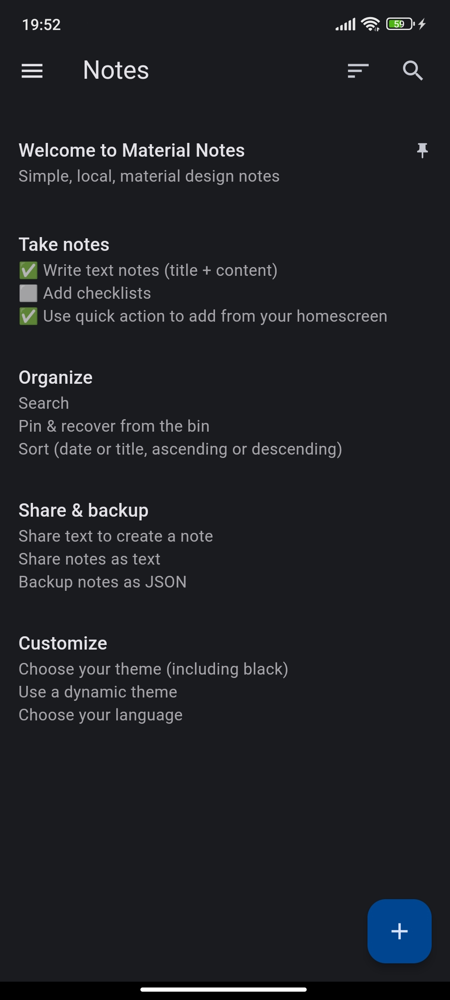
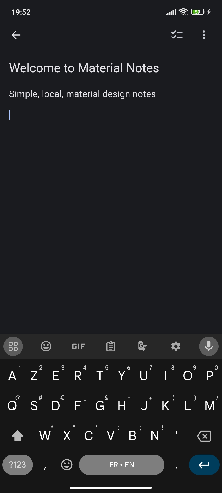
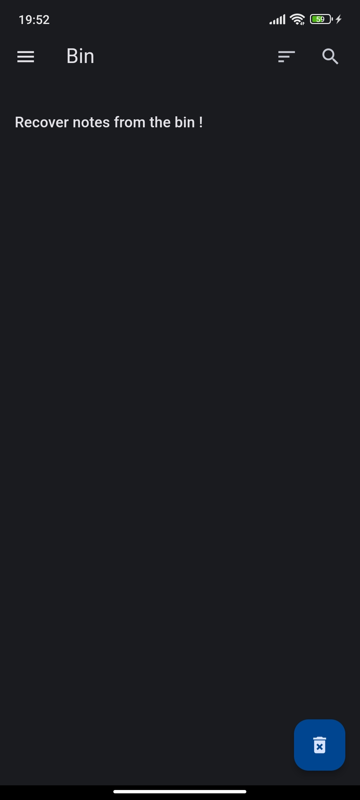

# Local Material Notes

Simple, local, material design notes.

  
  
  

## Features

### Take notes

- Write text notes (title + content)
- Add checklists along the normal text
- Use the quick action from your home screen to quickly add a note

### Organize

- Search though your notes
- Sort your notes by date or title, in ascending or descending order
- Pin your notes
- Recover your deleted notes from the bin

### Share & backup

- Share text from other applications to add it directly to a note
- Share your notes as text
- Export your notes as JSON and import them back

### Customize

- Choose your theme (light, dark or black)
- Choose if you want your theme to be dynamic (use colors from your system, if supported)
- Choose your language (see the [supported ones](#supported-languages))

## Screenshots

See more screenshots [here](https://github.com/maelchiotti/LocalMaterialNotes/tree/main/assets/screenshots).

## Supported languages

- English: 100%
- French: 100%

---

## Enhancements

- Highlight search terms in the title/content of the list tiles in the search view: [Highlightable](https://pub.dev/packages/highlightable) could work great for this, but if the text to highlight isn't in the first 3 lines then it is not shown.
- Better search: Improve the search to be more effective than the current `contains()`.
